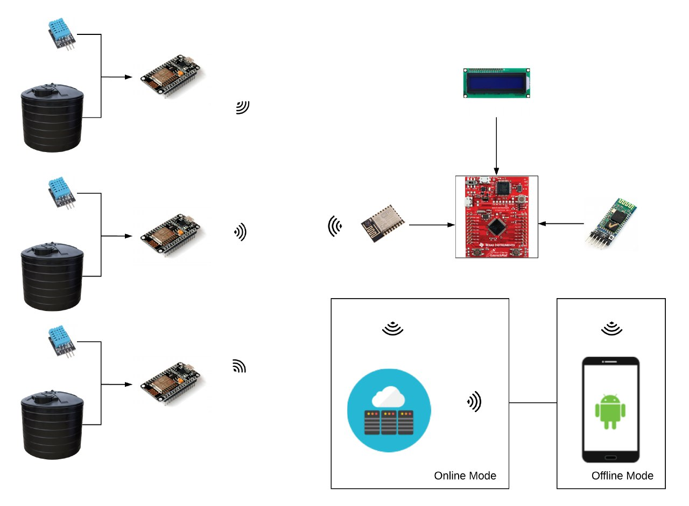

# bil-496
bitirme2

In this project, we create a system that transmits the temperature, humidity and
water tank level information of 3 different greenhouses to a center that has distance
about 100mt from them and presents the coming informations on the LCD screen
and phone application to user.

The project is divided into two parts under the headings of greenhouses and
center(home, etc.). In greenhouses, environment data is read by sensors and
transmitted to center by wifi signals. Then coming data managed and presented on
the LCD and on the phone application to the user.